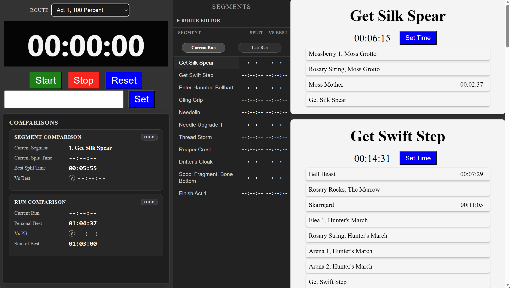
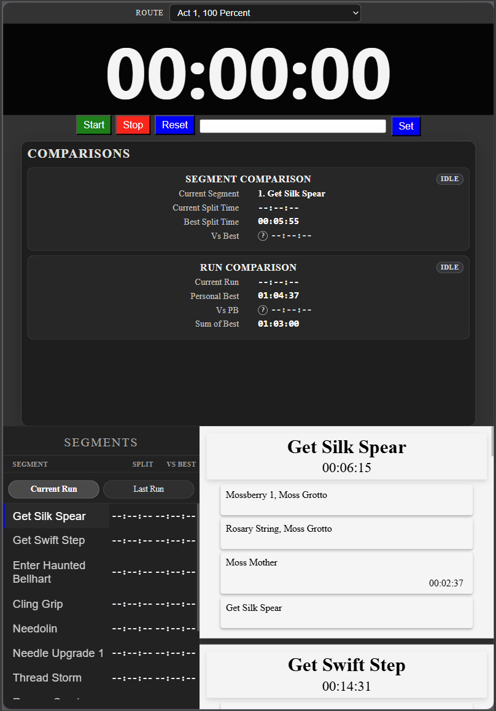
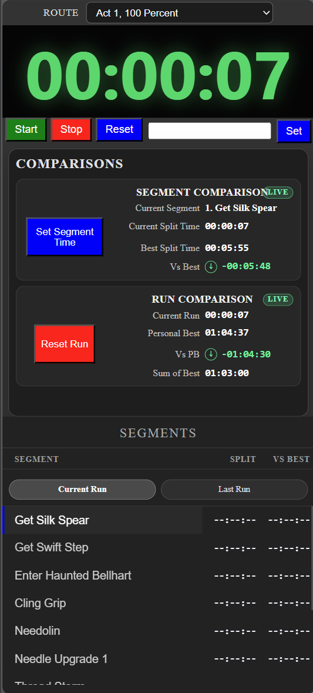
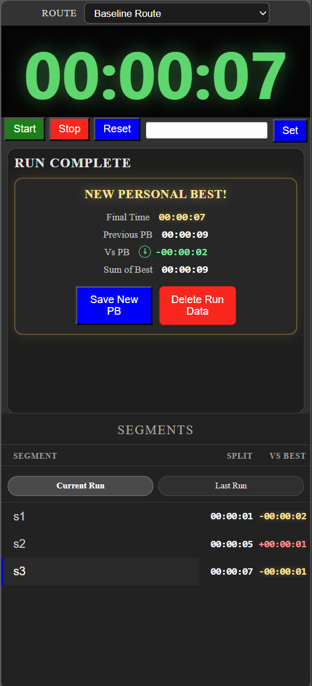

# Split Timer

Split Timer is a browser-based video game speedrun split timer built with vanilla JavaScript, HTML, CSS, and a small Node server. It is designed to track route segments, compare current run progress against personal best data, save new PB runs, save gold splits, and edit route structure directly from the app.

The project was built as a portfolio piece and learning project, with an emphasis on modular JavaScript, responsive layout, route data management, and test coverage.

## Features

* Start, stop, reset, and manually set timer values
* Route selector with start screen
* Segment and subsegment route display
* Current run comparison against PB and gold split data
* Run Complete panel for saving new PB runs or gold splits
* Last Run sidebar review
* Route editor for adding, renaming, deleting, and clearing segment data
* Sidebar context menu for segment actions
* Responsive layouts for desktop, tablet, and phone-sized screens
* Route data saved through local JSON files during development
* Custom JavaScript test runner for unit and smoke-style behavior tests

## Current Version Notes

This version focuses on making the app feel like a stable, usable speedrunning tool.

### Recent improvements include:

* Improved run completion and saving behavior, including first-run PB detection, New PB saves, gold split saves, and stopping the stopwatch correctly after Run Complete actions.
* Refactored route editor and sidebar actions into cleaner controller-based behavior, including rename, delete, clear split, and Set Segment Time flows.
* Improved route/sidebar scrolling so route navigation stays inside the route panel instead of scrolling the whole page.
* Added responsive desktop, tablet, and phone layouts, with organized CSS loaded through a single main stylesheet.

## Screenshots






## Getting Started

### Requirements

You need Node.js installed on your machine.

This project does not use a large framework or build system. The app is mostly plain HTML, CSS, and JavaScript served through a small Node server.

### Install

Clone the repository:

```bash
git clone https://github.com/hugovela1980/split-timer.git
cd split-timer
```

Install dependencies:

```bash
npm install
```

### Run the App

Start the local server:

```bash
npm start
```

Then open the app in your browser using the local address shown in the terminal.

## Running Tests

Run the test suite with:

```bash
npm test
```

The project uses a custom test runner located in the `tests` folder. The tests cover route loading behavior, run save behavior, timing helpers, route editor behavior, sidebar context menu behavior, and responsive-related controller behavior.

## Project Structure

```txt
split-timer/
├── public/
│   ├── css/
│   │   ├── main.css
│   │   ├── start-screen.css
│   │   ├── main-responsive-desktop.css
│   │   ├── desktop-wrap-layout.css
│   │   ├── tablet-split-layout.css
│   │   └── phone-layout.css
│   ├── data/
│   │   └── routes/
│   ├── js/
│   │   ├── app/
│   │   ├── controllers/
│   │   ├── services/
│   │   ├── ui/
│   │   └── utils/
│   └── index.html
├── server/
│   └── server.js
├── tests/
├── docs/
├── package.json
└── README.md
```

## Architecture Overview

The app is organized around a main controller and several smaller controller/service files.

### Main App Controller

`SplitTimerController` coordinates the main app behavior. It loads route data, initializes controllers, renders the route/sidebar/comparison panels, manages run state, and connects UI events to route data changes.

### Controllers

Controller files handle specific areas of the interface, such as:

* Start screen behavior
* Route editor behavior
* Sidebar review tabs
* Scroll navigation
* Comparison panel rendering

This keeps some of the UI logic separated instead of placing all behavior in one large file.

### Services

Service files handle data-related responsibilities, such as:

* Loading route data
* Managing route selector data
* Saving route data
* Handling confirmed run save behavior

### UI Helpers

The `ui` folder contains functions that generate HTML for route segments, subsegments, sidebars, and comparison panels.

### Utilities

The `utils` folder contains shared helper functions for time conversion, timing field normalization, route data cleanup, escaping HTML, and related logic.

## Route Data

Routes are stored as JSON files. Each route contains segment data, timing fields, PB split data, gold split data, and route-level stats such as personal best and sum of best.

The app currently includes compatibility handling for older timing field names while moving toward a cleaner route data schema.

## Testing Approach

The project uses a custom test runner instead of a full testing framework. This keeps the setup lightweight while still allowing the app to test important behavior.

Tests focus on:

* Route switching
* Start screen behavior
* Run completion and PB save logic
* Gold split behavior
* Timing helper functions
* Route editor actions
* Sidebar context menu behavior
* Controller callback behavior

The goal is to protect the most important app behavior while still keeping the project understandable.

## Development Notes

This project intentionally uses vanilla JavaScript instead of a front-end framework. The goal was to practice core JavaScript, DOM manipulation, event handling, modular code organization, and test-driven refactoring.

Several areas have been refactored into controllers and services, but some legacy structure remains. Future cleanup work may include removing the route data compatibility layer, simplifying timing field names, and further separating stopwatch behavior from route/controller behavior.

## Possible Future Improvements

* Remove the timing compatibility layer after route data migration is complete
* Finalize a cleaner route JSON schema
* Improve route editor workflows
* Add import/export tools for route files
* Add more automated tests around responsive behavior
* Add screenshots or GIFs to this README
* Add deployment instructions if the app is hosted publicly

## Scripts

```bash
npm start
```

Starts the local Node server.

```bash
npm test
```

Runs the custom test suite.
